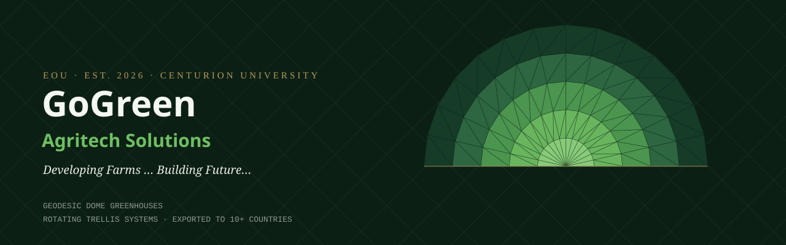
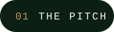
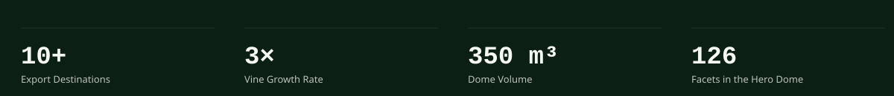
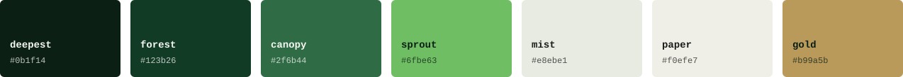
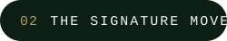
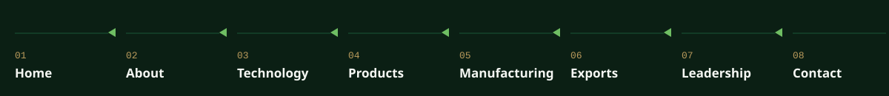
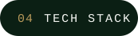
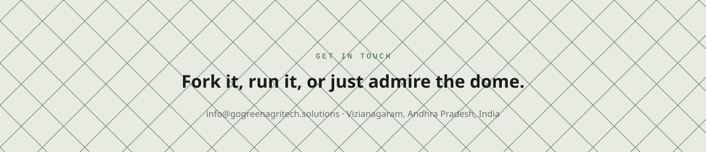
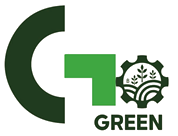

<div align="center">
  
</div>

<div align="center">

[](https://react.dev)
[](https://www.typescriptlang.org)
[](https://vite.dev)
[](https://tailwindcss.com)
[](https://www.framer.com/motion/)
[](#08--license)

</div>

<br />



Real vanilla vines grow **three times faster** inside a patented geodesic
dome than in an open field. GoGreen Agritech Solutions builds those domes —
along with the automated rotating trellis systems that spin each plant
toward the light — at Centurion University in India, and exports them to
ten-plus countries under a buyback agreement with an Australian technology
partner.

This repo is that company's website: a from-scratch build where every
design decision — the palette, the type, the section rhythm — is pulled
from the product itself, not a template.

<div align="center">
  
</div>

<div align="center">
  
</div>

<br />



The homepage hero doesn't use a stock icon for its dome. It **is** the dome —
generated from real polar-coordinate geometry (five concentric rings ×
fourteen radial segments, triangulated like an actual geodesic frame), then
assembled facet-by-facet with a staggered GSAP entrance on load. Open
[`GeodesicDome.tsx`](src/features/home/components/GeodesicDome.tsx) and
you'll find math, not an `` tag.

```
ring 0 ──▶ apex, 14 facets, single point of origin
ring 1 ──▶ 28 facets, first full band
ring 2 ──▶ 28 facets
ring 3 ──▶ 28 facets
ring 4 ──▶ 28 facets, base ring, 126 triangles total
```

<br />


<div align="center">
  
</div>

<details open>
<summary><b>🏠 Home</b> — the dome hero, live stats, and a preview rail of every section below</summary>
<br>
Everything the site does, condensed into one scroll: the assembling geodesic dome, headline stats pulled straight from the pilot program, and a preview of every page that follows.
</details>

<details>
<summary><b>🧭 About</b> — mission, timeline, and the ecosystem behind the company</summary>
<br>
Mission & values, a founding timeline, the five-company Centurion / Gram Tarang ecosystem, and UN SDG alignment — the credibility case for a university-incubated export venture.
</details>

<details>
<summary><b>⚙️ Technology</b> — the engineering behind Controlled Environment Agriculture</summary>
<br>
Four subsystems, explained as a system: climate control, the rotating trellis, the automation partner, and the patented dome geometry itself.
</details>

<details>
<summary><b>📦 Products</b> — full specification sheets, not marketing copy</summary>
<br>
The Dome Frame, Rotating Trellis, and Automation Control System, each on its own alternating light/dark section with a real spec list and an enquiry CTA.
</details>

<details>
<summary><b>🏭 Manufacturing</b> — the real eleven-stage fabrication line</summary>
<br>
Stock intake through dispatch crate, floor equipment with quantities, and raw materials down to their actual HS codes.
</details>

<details>
<summary><b>🌍 Exports</b> — where every unit ships, and why</summary>
<br>
Destination markets, the Advent Group (Australia) partnership terms, and the import → fabricate → export trade flow that makes the whole business model work.
</details>

<details>
<summary><b>👥 Leadership</b> — full director biographies</summary>
<br>
Not headshots and job titles — real multi-paragraph biographies pulled from the company's own project reports.
</details>

<details>
<summary><b>✉️ Contact</b> — a form that actually validates</summary>
<br>
React Hook Form + Zod, a business/career toggle, and a genuine success state — ready to wire to a live endpoint.
</details>

<br>


<br><br>

<div align="center">


</div>

<br />


```bash
npm install          # install dependencies
npm run dev           # start the dev server
npx tsc --noEmit        # type-check
npm run build             # production build
```

<br />


```
src/
├── assets/               # logos, icons, images, fonts
├── components/
│   ├── common/            # PageHero, ScrollToTop, PlaceholderPage
│   ├── layout/             # Header, Footer
│   ├── ui/                  # Button, Container, Eyebrow, StatBlock, SectionNumeral…
│   ├── animations/          # Reveal — the one scroll-reveal pattern, used everywhere
│   └── forms/                # TextField, TextAreaField
├── features/
│   ├── home/                 # geodesic dome hero + every preview section
│   └── about/ technology/ products/ manufacturing/ exports/ leadership/ contact/
├── constants/              # company facts, products, leadership bios, export markets…
├── context/                # LenisContext — smooth-scroll provider
├── hooks/  lib/  routes/  styles/  types/
```

> Feature-based, not layer-based: each page owns its components end-to-end.
> Shared primitives live in `components/`. Nothing over ~300 lines.

<br />


| Status | Item |
|---|---|
| 🔜 Next | Route-level code-splitting (current bundle: ~630 KB) |
| 🔜 Next | Wire the contact form to a live enquiry endpoint |
| 🧭 Planned | Interactive export map on the Exports page |
| 🧭 Planned | Careers & News sections |

<br />




Proprietary — © GoGreen Agritech Solutions International Private Limited.

<div align="center">
  <br>
  
  <br><br>
  <sub>Incubated at Centurion University of Technology &amp; Management, Vizianagaram, India.</sub>
</div>
